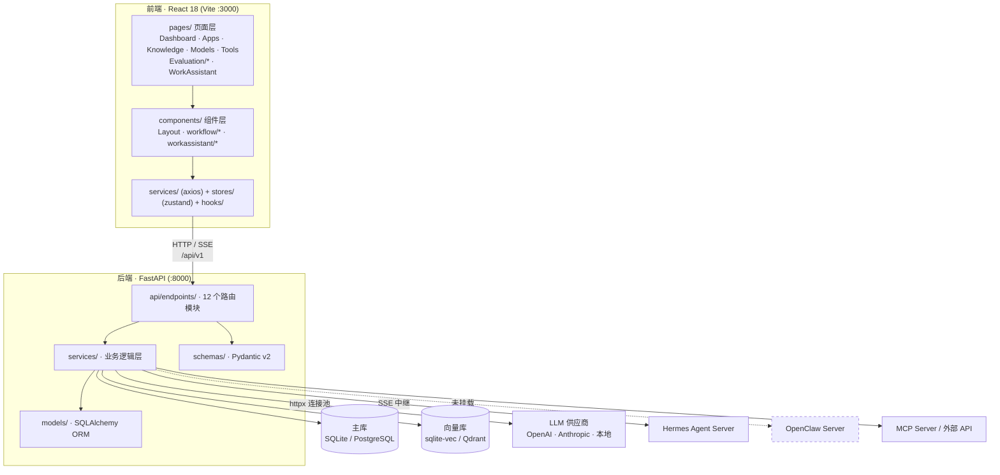
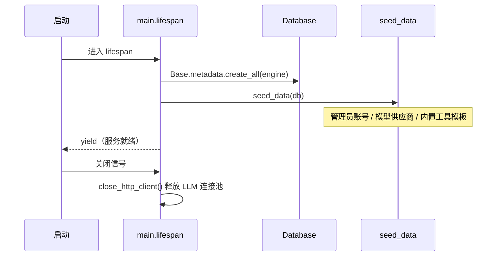
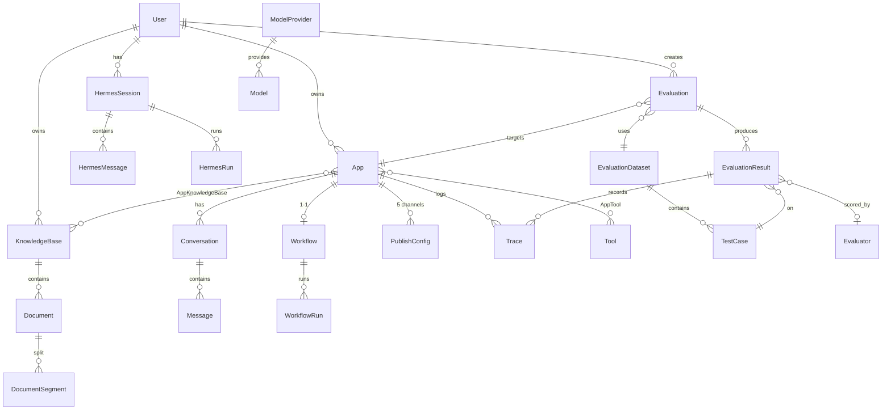
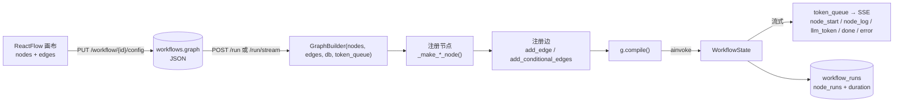
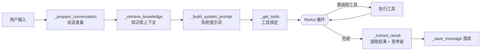
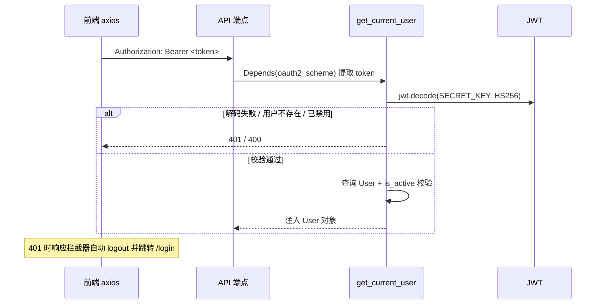
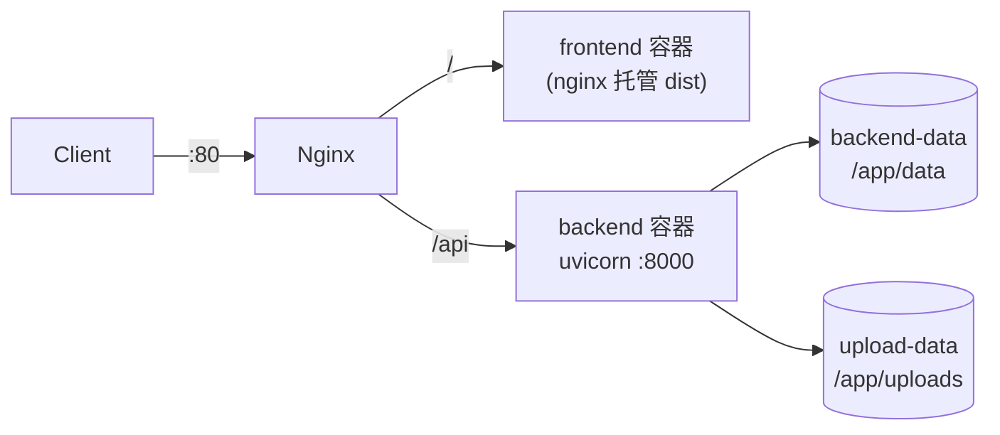

# 智能体平台 — 系统架构文档

> 本文是项目的**架构主文档**，面向新加入的开发者与维护者。
> 详细子主题请见：[数据库设计](./DATABASE.md) · [接口文档](./API.md) · [后端模块](./MODULES.md) · [前端架构](./FRONTEND.md)

---

## 目录

- [1. 项目定位](#1-项目定位)
- [2. 技术栈](#2-技术栈)
- [3. 整体架构](#3-整体架构)
- [4. 后端分层结构](#4-后端分层结构)
- [5. 数据模型总览](#5-数据模型总览)
- [6. API 地图](#6-api-地图)
- [7. 核心执行流程](#7-核心执行流程)
- [8. 配置体系](#8-配置体系)
- [9. 部署架构](#9-部署架构)
- [10. 关键设计决策](#10-关键设计决策)
- [11. 已知问题与技术债](#11-已知问题与技术债)

---

## 1. 项目定位

智能体平台是一个**低代码、可视化的 AI 应用开发平台**（对标 Dify / Coze），让用户在浏览器中完成应用的构建、调试、评估与发布全流程。

### 1.1 核心能力矩阵

| 能力域 | 说明 |
|---|---|
| **工作室** | 三类应用编排：聊天助手 / 工作流 / Agent，统一以 `App` 模型承载 |
| **知识库** | 文档解析、智能分片、向量检索、外部知识库接入、URL 爬取 |
| **工具集成** | 内置模板市场、MCP Server 自动导入、自定义插件 |
| **模型管理** | 多供应商（OpenAI / Anthropic / 本地 / 自定义）统一纳管 |
| **应用发布** | API / MCP / 平台嵌入 / 微信公众号 / H5 五个渠道 |
| **评估中心** | 数据集 + 评估器 + 实验（Experiment）+ 执行轨迹，参考 LangSmith 范式 |
| **工作助理** | 对接外部 Agent 服务（Hermes / OpenClaw）的 SSE 中继 |

### 1.2 三类应用对比

| 维度 | 聊天助手 `chatbot` | 工作流 `workflow` | 智能体 `agent` |
|---|---|---|---|
| 编排方式 | 表单配置 | 可视化 DAG（ReactFlow） | 表单配置 + 工具选择 |
| 执行引擎 | `ChatbotService` 线性管道 | LangGraph `StateGraph` | `AgentService` ReAct 循环 |
| 是否多轮 | 是（记忆窗口） | 否（单轮自动化） | 是 |
| 核心服务 | `services/chatbot.py` | `services/workflow.py` | `services/agent.py` |

---

## 2. 技术栈

### 2.1 后端

| 领域 | 选型 | 说明 |
|---|---|---|
| Web 框架 | FastAPI | 异步，自动生成 OpenAPI 文档 |
| ORM | SQLAlchemy 2.0 | `declarative_base()` 声明式模型 |
| 校验 | Pydantic v2 + pydantic-settings | 请求/响应 Schema 与配置 |
| 迁移 | Alembic | 开发期同时依赖 `create_all()` 自动建表 |
| 工作流 | **LangGraph** | `StateGraph` 动态编译 + `MemorySaver` checkpoint |
| LLM 调用 | httpx（全局连接池） | OpenAI / Anthropic 兼容协议 |
| 文档解析 | markitdown | PDF / DOCX / XLSX / HTML 等 |
| 向量化 | fastembed | 稠密 + 稀疏（BM25）嵌入 |
| 鉴权 | python-jose (JWT) + passlib (bcrypt) | OAuth2 Password Bearer |

### 2.2 前端

| 领域 | 选型 |
|---|---|
| 框架 | React 18 + TypeScript 5 |
| 构建 | Vite 5（dev port 3000，`/api` 代理至 8000） |
| UI | Ant Design 5 + @ant-design/pro-components + TailwindCSS 3 |
| 状态 | Zustand 4（`persist` 中间件落 localStorage） |
| 工作流画布 | ReactFlow 11 |
| 路由 | react-router-dom 6 |
| HTTP | axios（统一实例 + 拦截器） |

### 2.3 存储与部署

- **主库**：SQLite（默认，启用 WAL + `busy_timeout=5000`）或 PostgreSQL
- **向量库**：`sqlite-vec`（默认）/ `Qdrant`
- **部署**：Docker Compose（frontend + backend + nginx）

---

## 3. 整体架构



### 3.1 分层原则

```
API 层 (endpoints)  →  Service 层  →  Model 层
        ↑                  ↑
     schemas/          schemas/
```

- **依赖单向**：上层可调用下层，下层不得反向依赖
- **端点只做三件事**：参数校验（Pydantic）、调用 Service、序列化响应
- **Service 持有 `Session`**，通过工厂函数（`get_xxx_service(db)`）构造，便于依赖注入
- **ORM 模型不直接暴露给 API**，统一经 `schemas/` 转换

---

## 4. 后端分层结构

```
backend/
├── app/
│   ├── main.py                 # FastAPI 入口：lifespan / CORS / 路由挂载
│   ├── core/                   # 基础设施
│   │   ├── config.py           # Settings（pydantic-settings）
│   │   ├── database.py         # engine / SessionLocal / Base
│   │   ├── security.py         # JWT + bcrypt + oauth2_scheme
│   │   └── seed.py             # 启动种子数据
│   ├── api/
│   │   ├── api.py              # 路由聚合器（统一前缀 /api/v1）
│   │   └── endpoints/          # 12 个业务模块
│   ├── models/                 # 20+ 张表的 ORM 定义
│   ├── schemas/                # Pydantic 请求/响应模型
│   ├── services/               # 业务核心（详见 MODULES.md）
│   │   └── datasets/           # 数据集加载器（BFCL）
│   └── utils/                  # deps / logger / pagination
├── alembic/                    # 数据库迁移
├── test/                       # 测试
├── uploads/                    # 上传文件
├── data/                       # 向量数据（sqlite-vec）
└── pyproject.toml
```

### 4.1 应用启动生命周期



> ⚠️ 生产环境建议使用 Alembic 迁移而非 `create_all()`，后者无法处理字段变更。

### 4.2 依赖注入

```python
# utils/deps.py
def get_db() -> Generator: ...                      # 数据库会话
def get_current_user(...) -> User: ...              # JWT → User
def get_current_active_superuser(...) -> User: ...  # 超级管理员校验
```

各 Service 提供工厂函数供端点使用：
`get_chatbot_service(db)` / `get_agent_service(db)` / `get_workflow_service(db)` / `get_knowledge_service(db)` / `get_trace_collector(db)` / `get_hermes_gateway()` / `get_openclaw_service(db)` 等。

---

## 5. 数据模型总览

> 字段级说明见 [DATABASE.md](./DATABASE.md)



### 5.1 关键设计

| 设计 | 说明 |
|---|---|
| **JSON 列承载灵活结构** | `App.config`、`Workflow.graph`、`Workflow.nodes_config`、`WorkflowRun.node_runs` 均以 JSON 存储，避免为图结构建大量关系表 |
| **图结构整体存取** | 前端 ReactFlow 的 nodes/edges 直接存入 `workflows.graph`，保存时 `version` 自增 |
| **Hermes 使用 UUID 主键** | 会话/消息/运行三表使用字符串 UUID，时间戳统一 UTC，级联删除 |
| **评估系统 LangSmith 范式** | Dataset → TestCase / Evaluator → Evaluation → EvaluationResult → Trace |
| **关联表带配置** | `AppKnowledgeBase`、`AppTool` 支持 `config` JSON，允许同一知识库/工具在不同应用中有不同参数 |

---

## 6. API 地图

> 完整清单见 [API.md](./API.md)

统一前缀 **`/api/v1`**，由 `api/api.py` 聚合：

| 前缀 | 模块 | 端点数 | 主要职责 |
|---|---|---|---|
| `/users` | users | 4 | 注册 / 登录 / 个人信息 |
| `/apps` | apps | 7 | 应用 CRUD、发布、会话与消息查询 |
| `/apps` | app_chat | 2 | 对外运行时对话接口 |
| `/apps/{id}/publish` | publish | 5 | 五渠道发布配置启停 |
| `/chatbot` | chatbot | 7 | 聊天助手配置与对话 |
| `/workflow` | workflow | 9 | 配置存取、执行、流式执行、DSL 导入导出 |
| `/agent` | agent | 6 | Agent 配置与对话 |
| `/knowledge` | knowledge | 13 | 知识库与文档全生命周期 |
| `/models` | models | 9 | 供应商与模型管理 |
| `/tools` | tools | 9 | 工具 CRUD、模板市场、MCP 导入 |
| `/evaluation` | evaluation | 27 | 数据集 / 评估器 / 实验 / 轨迹 / 分析 |
| `/hermes` | hermes | 7 | 工作助理会话与 SSE |

### 6.1 分页约定

项目存在**两套分页**机制：

| 类型 | 应用模块 | 参数 |
|---|---|---|
| **游标分页** `CursorResponse` | apps、knowledge | `cursor` + `limit` |
| **页码分页** | evaluation | `page` + `page_size` |

---

## 7. 核心执行流程

### 7.1 工作流执行（LangGraph）

工作流引擎的核心是 `GraphBuilder`：**从前端 DSL 动态编译 LangGraph StateGraph**。



**State 定义**（reducer 自动合并，避免节点间覆盖）：

```174:182:backend/app/services/workflow.py
class WorkflowState(TypedDict):
    """工作流执行状态"""

    # 用户输入
    inputs: Dict[str, Any]
    # 各节点输出（or reducer 自动合并字典）
    node_outputs: Annotated[Dict[str, Any], operator.or_]
    # 执行日志（add reducer 自动追加列表）
    execution_log: Annotated[List[Dict[str, Any]], operator.add]
```

**支持的 10 种节点类型**：

| 节点类型 | 工厂函数 | 说明 |
|---|---|---|
| `start` | `_make_start_node` | 透传 inputs 到 node_outputs |
| `end` | `_make_end_node` | 按 `output_keys` 提取最终输出 |
| `llm` | `_make_llm_node` / `_make_llm_node_streaming` | 调用大模型，支持结构化输出 |
| `knowledge_retrieval` | `_make_knowledge_node` | 知识库检索 |
| `condition` | `_make_condition_router` | IF/ELIF/ELSE 条件路由 |
| `question_classifier` | `_make_question_classifier_router` | 基于 LLM 的分类路由 |
| `code` | `_make_code_node` | Python 代码执行 |
| `http` | `_make_http_node` | 外部 API 调用 |
| `tool` | `_make_tool_node` | 调用已安装工具 |
| `human_intervention` | `_make_human_intervention_node` | 暂停等待人工审批 |

> `condition` 与 `question_classifier` 注册为 **noop 节点 + 条件路由函数**（`add_conditional_edges`），分支跳转逻辑放在路由函数中，节点本身不执行业务。

**图构建规则**（`GraphBuilder.build()`）：
1. 遍历 nodes 注册执行函数
2. 为 condition / question_classifier 收集出边，构建 `sourceHandle → target` 分支映射，追加 `__end__ → END`
3. 注册普通边（跳过已处理的条件出边）
4. 自动将 `START` 连到所有无入边节点，将所有无出边节点连到 `END`

### 7.2 聊天助手执行

```
用户输入 → 变量渲染 → 知识库检索（Top-K + 相似度阈值 + 可选 HyDE/查询扩展）
        → 系统提示词拼装 → 记忆窗口截取历史 → LLM 调用 → 落库 Message
```

### 7.3 Agent 执行（ReAct）

`AgentService` 基于 LangGraph 构建 ReAct 循环：



附带 `make_delete_old_messages(max_messages)` 中间件做历史裁剪，`_parse_thinking_tags()` 解析 `<thinking>` 标签。

### 7.4 认证链



### 7.5 工作助理 SSE 中继（Hermes）

```
前端 useChatStream → FastAPI /hermes/{sid}/stream → Hermes API Server
```

**FastAPI 仅做转发与落库，Agent 推理逻辑完全由远端 Hermes 承担。**

下发给前端的事件类型：`message_start` / `content_delta` / `tool_start` / `tool_result` / `message_end` / `error`

#### 上游协议（关键约束）

Hermes 侧并非纯 OpenAI 兼容接口，实测为**双通道混合**：

| 通道 | 形态 | 承载内容 |
|---|---|---|
| OpenAI 标准 chunk | 帧内无 `event:` 行 | `delta.content` 文本增量；末帧带 `finish_reason` + `usage` |
| 自定义事件 | `event: hermes.tool.progress` | 工具调用进度（`tool` / `label` / `toolCallId` / `status`） |

```
event: hermes.tool.progress
data: {"tool":"terminal","label":"ls -la","toolCallId":"call_xxx","status":"running"}
event: hermes.tool.progress
data: {"tool":"terminal","toolCallId":"call_xxx","status":"completed"}
```

由此产生三条必须遵守的约定：

1. **网关必须读取 SSE 的 `event:` 行来分流**。若只解析 `data:` 行并按 OpenAI 协议处理，工具事件会被当作"无 choices 的空 chunk"静默丢弃，`tool_start` / `tool_result` 永不触发。
2. **不能依赖 `finish_reason` 触发工具事件** —— 正文阶段它恒为 `null`。
3. **`tool_result.tool_output` 通常为空** —— Hermes 不回传工具输出，completed 帧只有工具名与 `toolCallId`，因此该事件仅用于标记调用结束。工具配对一律使用 `tool_call_id`。

> 详见 [MODULES.md §10.1](./MODULES.md#101-hermes已启用)。

---

## 8. 配置体系

配置由 `core/config.py` 的 `Settings`（pydantic-settings）统一管理。

**加载优先级**：`环境变量` > `.env.local` > `.env` > 代码默认值

### 8.1 主要配置项

| 分类 | 配置项 |
|---|---|
| 项目 | `PROJECT_NAME` / `PROJECT_VERSION` / `API_V1_STR` |
| 安全 | `SECRET_KEY` / `ALGORITHM` / `ACCESS_TOKEN_EXPIRE_MINUTES`（默认 8 天）/ `ADMIN_PASSWORD` |
| 数据库 | `DATABASE_URL` / `VECTOR_STORE` / `VECTOR_DB_DIR` |
| 向量 | `QDRANT_URL` / `QDRANT_COLLECTION` / `EMBEDDING_MODEL` / `EMBEDDING_SPARSE_MODEL` / `EMBEDDING_DIMENSION` / `RAG_SCORE_THRESHOLD` |
| 缓存 | `REDIS_URL`（可选） |
| 存储 | `UPLOAD_DIR` / `MAX_FILE_SIZE_MB` |
| LLM | `OPENAI_API_KEY` / `OPENAI_API_BASE` / `ANTHROPIC_API_KEY` / `LOCAL_LLM_BASE_URL` / `TAVILY_API_KEY` |
| 外部知识库 | `EXTERNAL_KB_API_URL` / `EXTERNAL_KB_API_KEY` |
| Hermes | `HERMES_API_URL` / `HERMES_API_KEY` / `HERMES_MODEL` / `HERMES_REQUEST_TIMEOUT` / `HERMES_MAX_HISTORY_MESSAGES` |
| CORS | `CORS_ORIGINS` / `BACKEND_CORS_ORIGINS`（逗号分隔字符串自动解析） |

> 完整模板见 `backend/.env.example`。

---

## 9. 部署架构



| 服务 | 镜像来源 | 端口 | 说明 |
|---|---|---|---|
| `frontend` | `../frontend/Dockerfile` | 3000 → 80 | 构建产物由 nginx 托管 |
| `backend` | `../backend/Dockerfile` | 8000 | uvicorn，挂载数据与上传卷 |
| `nginx` | `nginx:alpine` | 80 | 反向代理，挂载 `nginx.conf` |

```bash
cd docker && docker-compose up -d --build
```

---

## 10. 关键设计决策

| # | 决策 | 原因 / 收益 | 代价 |
|---|---|---|---|
| 1 | 图结构以 **JSON 列**存储 | 图结构频繁变更，避免大量关系表与迁移 | 难以做 SQL 层面的图查询 |
| 2 | 工作流用 **LangGraph** 而非自研拓扑排序 | 原生支持条件边、checkpoint、流式 | 引入较重的依赖 |
| 3 | LLM 调用使用**全局 httpx 连接池** | 复用 TCP/TLS，显著降低延迟 | 需在 lifespan 显式关闭 |
| 4 | SQLite 默认 + **WAL 模式** | 零配置启动，缓解并发读写的锁问题 | 仍不适合高并发写入 |
| 5 | Hermes 采用 **SSE 中继**而非本地实现 | Agent 逻辑与平台解耦，可独立演进 | 强依赖外部服务可用性 |
| 6 | 开发期用 `create_all()` 建表 | 新环境零成本启动 | 生产必须用 Alembic |
| 7 | 三类应用统一 `App` 模型 + `app_type` 枚举 | 发布、会话、评估等横切能力复用 | `config` JSON 缺乏类型约束 |

---

## 11. 已知问题与技术债

| # | 问题 | 影响 | 位置 |
|---|---|---|---|
| 1 | **OpenClaw 模块未挂载**：`api/endpoints/openclaw.py`、`services/openclaw*.py`、`models/openclaw.py` 均已实现，但 `api.py` 未 include 其 router | 功能完全不可达 | `backend/app/api/api.py` |
| 2 | **OpenClaw 模型未导出**：`OpenClawSession/Message/Run` 未加入 `models/__init__.py` | 可能导致建表缺失 | `backend/app/models/__init__.py` |
| 3 | **OpenClaw 无配置项**：`config.py` 缺少 `OPENCLAW_*` 相关配置 | 无法配置服务地址 | `backend/app/core/config.py` |
| 4 | **pgvector 配置项无实现**：`VECTOR_STORE` 支持 `pgvector`，但 `vector_store.py` 仅实现 `SQLiteVecStoreService` 与 `QdrantStoreService` | 选择 pgvector 会失败 | `backend/app/services/vector_store.py` |
| 5 | **SQLite 检查点文件疑似入库**：仓库根目录存在 `agent_platform.db-x-checkpoints-*` 二进制文件 | 仓库污染 | 仓库根目录 |
| 6 | **分页机制不统一**：apps/knowledge 用游标分页，evaluation 用页码分页 | 前端需两套处理逻辑 | `utils/pagination.py` |
| 7 | **文档分散**：`docs/` 下多份历史文档与 README/CLAUDE.md 内容重叠 | 维护成本高 | `docs/` |
| 8 | 前端 `services/openclaw.ts` 存在但无对应页面路由 | 死代码 | `frontend/src/services/` |

---

## 附录：常用命令

### 后端

```bash
cd backend
pip install -e ".[dev,sqlite]"     # 安装依赖
uvicorn app.main:app --reload --host 0.0.0.0 --port 8000 --reload-exclude "test/"
black app/ && ruff check app/      # 代码质量
alembic revision --autogenerate -m "描述" && alembic upgrade head
```

### 前端

```bash
cd frontend
pnpm install
pnpm dev      # :3000，自动代理 /api → :8000
pnpm build
pnpm lint
```

### 访问入口

| 地址 | 说明 |
|---|---|
| http://localhost:3000 | 前端应用 |
| http://localhost:8000/docs | Swagger API 文档 |
| http://localhost:8000/redoc | ReDoc 文档 |
| http://localhost:8000/health | 健康检查 |
