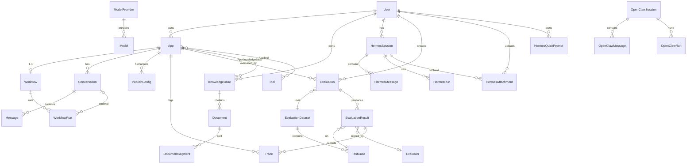
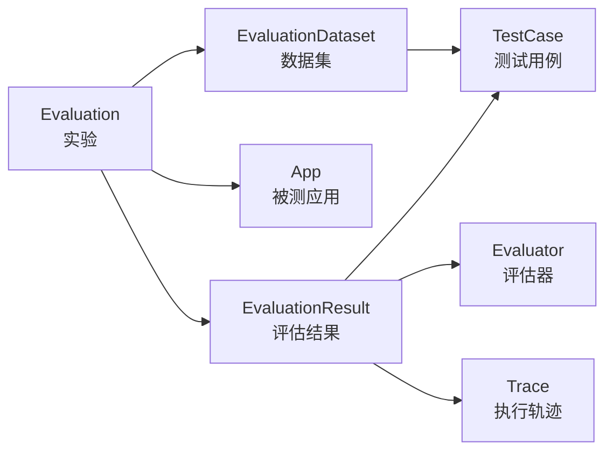

# 数据库设计文档

> 本文档描述智能体平台的全部数据模型、字段含义与表间关系。
> 返回 [架构主文档](./ARCHITECTURE.md)

---

## 目录

- [1. 概述](#1-概述)
- [2. 实体关系总览](#2-实体关系总览)
- [3. 用户与权限](#3-用户与权限)
- [4. 应用域](#4-应用域)
- [5. 知识库域](#5-知识库域)
- [6. 模型与工具域](#6-模型与工具域)
- [7. 对话域](#7-对话域)
- [8. 工作流域](#8-工作流域)
- [9. 发布域](#9-发布域)
- [10. 评估域](#10-评估域)
- [11. Hermes 域](#11-hermes-域)
- [12. OpenClaw 域](#12-openclaw-域)
- [13. 枚举字典](#13-枚举字典)
- [14. 迁移与建表](#14-迁移与建表)

---

## 1. 概述

| 项 | 值 |
|---|---|
| ORM | SQLAlchemy 2.0（`declarative_base()`） |
| 基类 | `app.core.database.Base` |
| 默认数据库 | SQLite（`sqlite:///./agent_platform.db`，WAL 模式 + `busy_timeout=5000`） |
| 生产数据库 | PostgreSQL（连接池 `pool_size=10, max_overflow=20, pool_pre_ping=True`） |
| 迁移工具 | Alembic（开发期同时依赖 `create_all()`） |
| 主键策略 | 业务表用自增 `Integer`；Hermes 表用 UUID 字符串 |
| 时间字段 | 业务表 `datetime.utcnow`；Hermes 表 `datetime.now(timezone.utc)` |

**通用约定**：
- JSON 字段统一使用 `JSON` 类型列
- 因 `metadata` 是 SQLAlchemy 保留名，元数据列统一命名为 `metadata_`，实际列名为 `metadata`
- 关联表（多对多）带 `config` JSON 列以支持差异化配置

---

## 2. 实体关系总览



---

## 3. 用户与权限

### `users` — 用户表

| 字段 | 类型 | 约束 | 说明 |
|---|---|---|---|
| `id` | Integer | PK, index | |
| `email` | String(255) | unique, index, NOT NULL | |
| `username` | String(100) | unique, index, NOT NULL | 登录用户名 |
| `hashed_password` | String(255) | NOT NULL | bcrypt 哈希 |
| `full_name` | String(100) | | |
| `is_active` | Boolean | default `true` | 禁用后无法登录 |
| `is_superuser` | Boolean | default `false` | 超级管理员 |
| `created_at` / `updated_at` | DateTime | | `updated_at` 自动更新 |

**关系**：`apps`（1:N）、`knowledge_bases`（1:N）

---

## 4. 应用域

### `apps` — 应用表（三类应用统一承载）

| 字段 | 类型 | 约束 | 说明 |
|---|---|---|---|
| `id` | Integer | PK, index | |
| `name` | String(100) | NOT NULL | |
| `description` | Text | | |
| `app_type` | Enum | NOT NULL, default `chatbot` | `chatbot` / `workflow` / `agent` |
| `icon` | String(500) | | |
| `status` | Enum | default `draft` | `draft` / `published` / `disabled` |
| `owner_id` | Integer | FK → `users.id`, NOT NULL | |
| `config` | JSON | | **应用配置**，结构随 `app_type` 而异 |
| `version` | Integer | default 1 | |
| `created_at` / `updated_at` / `published_at` | DateTime | | |

**关系**：`owner`、`conversations`、`app_knowledge_bases`、`publish_configs`（backref）

> `config` JSON 的内容由各类型的 Schema 定义：
> - chatbot → `schemas/chatbot.py: ChatbotConfig`
> - agent → `schemas/agent.py: AgentConfig`
> - workflow → 图结构存于 `workflows.graph`，而非此处

### `app_knowledge_bases` — 应用与知识库关联表

| 字段 | 类型 | 说明 |
|---|---|---|
| `id` | Integer PK | |
| `app_id` | Integer FK → `apps.id` | |
| `knowledge_base_id` | Integer FK → `knowledge_bases.id` | |
| `created_at` | DateTime | |

### `app_tools` — 应用与工具关联表

| 字段 | 类型 | 说明 |
|---|---|---|
| `id` | Integer PK | |
| `app_id` | Integer FK → `apps.id` | |
| `tool_id` | Integer FK → `tools.id` | |
| `config` | JSON | 工具在该应用中的特定配置 |
| `created_at` | DateTime | |

---

## 5. 知识库域

### `knowledge_bases` — 知识库表

| 字段 | 类型 | 说明 |
|---|---|---|
| `id` | Integer PK | |
| `name` | String(100) NOT NULL | |
| `description` | Text | |
| `kb_type` | Enum default `local` | `local` / `external` |
| `owner_id` | Integer FK → `users.id` | |
| `api_endpoint` / `api_key` / `api_config` | String / String / JSON | 外部知识库接入配置 |
| `status` | Enum default `active` | `active` / `inactive` / `processing` |
| `document_count` | Integer default 0 | 冗余统计 |
| `chunk_count` | Integer default 0 | 冗余统计 |
| `created_at` / `updated_at` | DateTime | |

### `documents` — 文档表

| 字段 | 类型 | 说明 |
|---|---|---|
| `id` | Integer PK | |
| `knowledge_base_id` | Integer FK → `knowledge_bases.id` | |
| `name` | String(255) NOT NULL | |
| `file_path` | String(500) | |
| `file_type` | Enum NOT NULL | `pdf` / `excel` / `markdown` / `docx` / `html` / `txt` / `epub` |
| `file_size` | Integer | 字节 |
| `source_type` | String(20) default `file` | `file` / `url` |
| `url` | String(2000) | 爬取来源 URL |
| `status` | String(20) default `pending` | 处理状态 |
| `error_message` | Text | |
| `chunk_strategy` | String(20) default `sliding_window` | 分片策略 |
| `content` | Text | 解析后的全文 |
| `chunk_count` | Integer default 0 | |
| `created_at` / `updated_at` / `processed_at` | DateTime | |

### `document_segments` — 文档分段表

| 字段 | 类型 | 说明 |
|---|---|---|
| `id` | Integer PK | |
| `document_id` | Integer FK → `documents.id` | |
| `content` | Text NOT NULL | 分片文本 |
| `token_count` | Integer | |
| `position` | Integer NOT NULL | 在文档中的顺序 |
| `embedding` | JSON | 向量（同时写入外部向量库） |
| `metadata` | JSON | 列名 `metadata`，模型属性 `metadata_` |
| `created_at` | DateTime | |

> **注意**：向量存在两处 —— `embedding` JSON 列（便于调试/回退）与向量库（`sqlite-vec` / Qdrant）。生产环境以向量库检索为准。

---

## 6. 模型与工具域

### `model_providers` — 模型供应商表

| 字段 | 类型 | 说明 |
|---|---|---|
| `id` | Integer PK | |
| `name` | String(100) NOT NULL | |
| `provider_type` | Enum NOT NULL | `openai` / `anthropic` / `local` / `custom` |
| `api_endpoint` | String(500) | |
| `api_key` | String(500) | |
| `api_config` | JSON | 额外配置 |
| `is_active` | Boolean default `true` | |
| `created_at` / `updated_at` | DateTime | |

### `models` — 模型表

| 字段 | 类型 | 说明 |
|---|---|---|
| `id` | Integer PK | |
| `provider_id` | Integer FK → `model_providers.id` | |
| `name` | String(100) NOT NULL | 展示名 |
| `model_id` | String(100) NOT NULL | 实际调用名，如 `gpt-4` |
| `description` | Text | |
| `max_tokens` | Integer | |
| `supports_streaming` | Boolean default `true` | |
| `supports_function_calling` | Boolean default `false` | |
| `default_temperature` | Float default 0.7 | |
| `default_max_tokens` | Integer default 2048 | |
| `is_active` | Boolean default `true` | |
| `created_at` / `updated_at` | DateTime | |

### `tools` — 工具表

| 字段 | 类型 | 说明 |
|---|---|---|
| `id` | Integer PK | |
| `name` | String(100) NOT NULL | |
| `description` | Text | |
| `tool_type` | Enum default `builtin` | `builtin` / `plugin` / `mcp` |
| `icon` | String(500) | |
| `parameters_schema` | JSON | 参数 JSON Schema |
| `return_schema` | JSON | 返回值 JSON Schema |
| `endpoint` | String(500) | 插件 / MCP 工具地址 |
| `auth_config` | JSON | 认证配置 |
| `is_active` | Boolean default `true` | |
| `created_at` / `updated_at` | DateTime | |

---

## 7. 对话域

### `conversations` — 会话表

| 字段 | 类型 | 说明 |
|---|---|---|
| `id` | Integer PK | |
| `app_id` | Integer FK → `apps.id` | |
| `user_id` | Integer FK → `users.id` | 可空（匿名会话） |
| `title` | String(255) | |
| `status` | Enum default `active` | `active` / `archived` / `deleted` |
| `created_at` / `updated_at` | DateTime | |

**关系**：`messages`（按 `created_at` 排序）

### `messages` — 消息表

| 字段 | 类型 | 说明 |
|---|---|---|
| `id` | Integer PK | |
| `conversation_id` | Integer FK → `conversations.id` | |
| `role` | Enum NOT NULL | `user` / `assistant` / `system` |
| `content` | Text NOT NULL | |
| `metadata` | JSON | 属性名 `metadata_` |
| `model` | String(100) | 使用的模型 |
| `tokens_used` | Integer | |
| `latency` | Integer | 毫秒 |
| `created_at` | DateTime | |

---

## 8. 工作流域

### `workflows` — 工作流表

| 字段 | 类型 | 说明 |
|---|---|---|
| `id` | Integer PK | |
| `app_id` | Integer FK → `apps.id`, **unique** | 一个应用仅一个工作流 |
| `graph` | JSON NOT NULL | **整个图结构**（ReactFlow nodes + edges） |
| `nodes_config` | JSON | 节点配置详情 |
| `version` | Integer default 1 | 每次保存自增 |
| `created_at` / `updated_at` | DateTime | |

`graph` JSON 结构：

```jsonc
{
  "nodes": [
    { "id": "node-1", "type": "start", "position": {...}, "data": { "config": {...} } }
  ],
  "edges": [
    { "id": "e1", "source": "node-1", "target": "node-2", "sourceHandle": "true" }
  ]
}
```

### `workflow_runs` — 工作流运行记录表

| 字段 | 类型 | 说明 |
|---|---|---|
| `id` | Integer PK | |
| `workflow_id` | Integer FK → `workflows.id` | |
| `conversation_id` | Integer FK → `conversations.id` | 可空 |
| `status` | Enum default `pending` | `pending` / `running` / `completed` / `failed` |
| `inputs` / `outputs` | JSON | |
| `node_runs` | JSON | **每个节点的执行结果**（`node_id → output`） |
| `error_message` | Text | |
| `started_at` / `finished_at` | DateTime | |
| `duration` | Integer | 毫秒 |
| `created_at` | DateTime | |

---

## 9. 发布域

### `publish_configs` — 发布配置表

| 字段 | 类型 | 说明 |
|---|---|---|
| `id` | Integer PK | 自增 |
| `app_id` | Integer FK → `apps.id` (CASCADE), index | |
| `channel` | Enum NOT NULL | `api` / `mcp` / `embed` / `wechat` / `h5` |
| `enabled` | Boolean default `false` | |
| `config` | Text | 渠道特定配置（API key、webhook URL 等，JSON 字符串） |
| `created_at` / `updated_at` | DateTime | |

> 每个应用每渠道一条记录，共 5 条。禁用渠道时配置保留。

---

## 10. 评估域

评估系统参考 **LangSmith** 范式设计。



### `evaluation_datasets` — 数据集表

| 字段 | 类型 | 说明 |
|---|---|---|
| `id` | Integer PK | |
| `name` | String(100) NOT NULL | |
| `description` | Text | |
| `dataset_type` | Enum default `custom` | `bfcl` / `gaia` / `custom` |
| `version` | String(20) default `1.0` | |
| `total_cases` | Integer default 0 | |
| `metadata` | JSON | 属性名 `metadata_` |
| `is_active` | Boolean default `true` | |
| `created_at` / `updated_at` | DateTime | |

### `test_cases` — 测试用例表

| 字段 | 类型 | 说明 |
|---|---|---|
| `id` | Integer PK | |
| `dataset_id` | Integer FK → `evaluation_datasets.id` (CASCADE) | |
| `case_id` | String(100) NOT NULL | 外部 ID，如 `bfcl_simple_001` |
| `category` | String(50) | 测试类别 |
| `difficulty` | Enum default `medium` | `easy` / `medium` / `hard` |
| `input_query` | Text NOT NULL | 输入 |
| `input_context` | JSON | 上下文 |
| `input_tools` | JSON | 可用工具定义 |
| `expected_answer` | Text | 期望答案 |
| `expected_trajectory` | JSON | 期望执行轨迹 |
| `expected_tools` | JSON | 期望调用的工具 |
| `tags` | JSON | 标签列表 |
| `metadata` | JSON | 属性名 `metadata_` |
| `created_at` | DateTime | |

### `evaluators` — 评估器表

| 字段 | 类型 | 说明 |
|---|---|---|
| `id` | Integer PK | |
| `name` / `description` | String(100) / Text | |
| `evaluator_type` | Enum NOT NULL | `heuristic` / `llm_judge` / `trajectory` / `custom` |
| `config` | JSON | |
| `judge_model` | String(50) | LLM 裁判模型 |
| `judge_prompt` | Text | 评分提示词 |
| `metric_type` | Enum | `exact_match` / `contains` / `regex` / `json_match` / `tool_accuracy` / `trajectory_match` / `numeric_match` |
| `script_content` | Text | 自定义评估脚本 |
| `is_builtin` | Boolean default `false` | |
| `is_active` | Boolean default `true` | |
| `created_at` / `updated_at` | DateTime | |

### `evaluations` — 评估任务表（Experiment）

| 字段 | 类型 | 说明 |
|---|---|---|
| `id` | Integer PK | |
| `name` / `description` | String(100) / Text | |
| `app_id` | Integer FK → `apps.id` | 被测应用 |
| `dataset_id` | Integer FK → `evaluation_datasets.id` | |
| `user_id` | Integer FK → `users.id` | |
| `evaluator_ids` | JSON | 使用的评估器 ID 列表 |
| `config` | JSON | 并发数、超时等 |
| `status` | Enum default `pending` | `pending` / `running` / `completed` / `failed` |
| `progress` | Integer default 0 | 百分比 |
| `total_cases` / `completed_cases` / `success_cases` | Integer default 0 | |
| `overall_score` | Float | 总体得分 |
| `started_at` / `completed_at` / `created_at` | DateTime | |

### `evaluation_results` — 评估结果表

| 字段 | 类型 | 说明 |
|---|---|---|
| `id` | Integer PK | |
| `evaluation_id` | Integer FK → `evaluations.id` (CASCADE) | |
| `test_case_id` | Integer FK → `test_cases.id` | |
| `evaluator_id` | Integer FK → `evaluators.id` | 可空 |
| `actual_answer` | Text | 实际答案 |
| `actual_output` | JSON | 完整输出（含中间步骤） |
| `actual_trajectory` | JSON | 实际执行轨迹 |
| `score` | Float | 0–1 |
| `score_details` | JSON | 各维度得分 |
| `passed` | Boolean default `false` | |
| `execution_time` | Integer | 毫秒 |
| `error_message` | Text | |
| `diagnostics` | JSON | 详细诊断 |
| `created_at` | DateTime | |

### `traces` — 执行轨迹表

| 字段 | 类型 | 说明 |
|---|---|---|
| `id` | Integer PK | |
| `evaluation_result_id` | Integer FK → `evaluation_results.id` (CASCADE) | 可空（非评估场景也有轨迹） |
| `app_id` | Integer FK → `apps.id` | |
| `conversation_id` | Integer | 非外键，弱关联 |
| `trace_type` | Enum NOT NULL | `agent` / `workflow` / `chatbot` |
| `status` | Enum default `running` | `running` / `completed` / `failed` |
| `steps` | JSON default `[]` | 执行步骤数组 |
| `total_steps` / `total_llm_calls` / `total_tool_calls` / `total_time_ms` / `total_tokens` | Integer default 0 | 汇总指标 |
| `input_query` / `output_answer` | Text | |
| `error_message` | Text | |
| `started_at` / `completed_at` | DateTime | |

---

## 11. Hermes 域

六张表（前四张 UUID 主键，附件/提示词为自增主键）：**UUID 主键 + 字符串外键 + UTC 时间戳 + 级联删除**（附件/提示词另含 `user_id` 归属字段）。

### `hermes_sessions` — 会话表

| 字段 | 类型 | 说明 |
|---|---|---|
| `id` | String PK | UUID，默认 `uuid.uuid4()` |
| `user_id` | Integer FK → `users.id`, index | |
| `title` | String(255) default `新会话` | |
| `model` | String(100) default `""` | 会话级模型覆盖，空表示用全局默认 |
| `created_at` / `updated_at` | DateTime(timezone=True) | UTC |

**关系**：`messages`（按 `created_at` 升序）、`runs`（按 `created_at` 降序），均 `cascade="all, delete-orphan"`

### `hermes_messages` — 消息表

| 字段 | 类型 | 说明 |
|---|---|---|
| `id` | String PK | UUID |
| `session_id` | String FK → `hermes_sessions.id` (CASCADE), index | |
| `role` | String(20) NOT NULL | `user` / `assistant` |
| `content` | Text default `""` | |
| `tools_used` | JSON default `[]` | `[{"name": "terminal", "command": "ls"}]` |
| `token_input` / `token_output` | Integer default 0 | |
| `created_at` | DateTime(timezone=True) | |

### `hermes_runs` — 运行记录表

| 字段 | 类型 | 说明 |
|---|---|---|
| `id` | String PK | UUID |
| `session_id` | String FK → `hermes_sessions.id` (CASCADE), index | |
| `status` | String(20) default `running` | `running` / `completed` / `error` |
| `tools_used` | JSON default `[]` | |
| `token_input` / `token_output` | Integer default 0 | |
| `latency_ms` | Float default 0.0 | |
| `error_message` | Text default `""` | |
| `created_at` | DateTime(timezone=True) | |

> 一次请求产生一条 run 记录；一个 run 内的每个 SSE 事件存为一条 message。

### `hermes_attachments` — 会话附件表

图片走视觉通道（转 base64 data URI），文档解析为文本注入上下文。

| 字段 | 类型 | 说明 |
|---|---|---|
| `id` | Integer PK | 自增 |
| `user_id` | Integer FK → `users.id`, index | 归属（预览/删除鉴权） |
| `session_id` | String FK → `hermes_sessions.id` (CASCADE), index | 发送后绑定会话，未发送为空 |
| `message_id` | String FK → `hermes_messages.id` (CASCADE), index | 绑定到具体消息 |
| `kind` | String(20) NOT NULL | `image` / `document` |
| `filename` | String(255) NOT NULL | 原始文件名 |
| `stored_name` | String(255) NOT NULL | UUID 落盘名（防路径穿越/覆盖） |
| `file_path` | String(500) NOT NULL | 相对 `UPLOAD_DIR` 的存储路径 |
| `mime_type` | String(100) | |
| `file_size` | Integer NOT NULL | 字节 |
| `parse_status` | String(20) default `pending` | `pending`/`parsed`/`failed`/`skipped` |
| `parsed_text` | Text | 文档解析文本（超限截断） |
| `parse_error` | Text | 解析失败原因 |
| `created_at` | DateTime(timezone=True) | |

### `hermes_quick_prompts` — 快捷提示词表

| 字段 | 类型 | 说明 |
|---|---|---|
| `id` | Integer PK | 自增 |
| `title` | String(100) NOT NULL | 卡片标题 |
| `description` | String(255) | 卡片副标题 |
| `content` | Text NOT NULL | 实际注入的提示词 |
| `icon` | String(50) | Ant Design 图标名（如 `BulbOutlined`） |
| `category` | String(50) default `general` | 分组：`writing`/`dev`/`analysis`/`productivity`/`general` |
| `sort_order` | Integer default 0 | 升序 |
| `is_builtin` | Boolean default False | 内置不可删除 |
| `owner_id` | Integer FK → `users.id`, index | 自建者；内置为空 |
| `is_active` | Boolean default True | |
| `created_at` / `updated_at` | DateTime(timezone=True) | UTC |

内置提示词由 `POST /hermes/quick-prompts/init-builtin` 按标题幂等初始化（默认 8 条覆盖写作/开发/分析/效率场景）。

---

## 12. OpenClaw 域

> ⚠️ **当前状态**：模型与 Service 已实现，但**未挂载路由、未导出到 `models/__init__.py`**，实际处于未启用状态。详见 [ARCHITECTURE.md §11](./ARCHITECTURE.md#11-已知问题与技术债)。

### `openclaw_sessions` — 会话表

| 字段 | 类型 | 说明 |
|---|---|---|
| `id` | Integer PK | |
| `user_id` | Integer FK → `users.id`, index | |
| `agent_id` | String(100) default `main` | |
| `title` | String(255) | |
| `created_at` / `updated_at` | DateTime | |

### `openclaw_messages` — 消息表

| 字段 | 类型 | 说明 |
|---|---|---|
| `id` | Integer PK | |
| `session_id` | Integer FK → `openclaw_sessions.id`, index | |
| `role` | String(20) NOT NULL | `user` / `assistant` / `tool`（String 以兼容 SQLite/PG） |
| `content` | **JSON** NOT NULL | OpenClaw 原始 content 数组：`[{"type":"output_text","text":"..."}]` |
| `run_id` | String(100) | |
| `tool_calls` | JSON | assistant：`[{"id","name","arguments"}]` |
| `tool_call_id` / `tool_name` | String(100) | tool 角色关联信息 |
| `created_at` | DateTime | |

### `openclaw_runs` — 任务记录表

| 字段 | 类型 | 说明 |
|---|---|---|
| `id` | String(100) PK | **由 OpenClaw 远端返回**（SSE `response.created`），非本地生成 |
| `session_id` | Integer FK → `openclaw_sessions.id`, index | |
| `user_id` | Integer, index | 冗余存储，权限校验无需 join |
| `status` | String(50) default `pending` | `pending`/`in_progress`/`completed`/`cancelled`/`failed` |
| `error` | JSON | |
| `created_at` | DateTime | |

---

## 13. 枚举字典

| 枚举名 | 所属表 | 取值 |
|---|---|---|
| `app_type_enum` | apps | `chatbot`, `workflow`, `agent` |
| `app_status_enum` | apps | `draft`, `published`, `disabled` |
| `kb_type_enum` | knowledge_bases | `local`, `external` |
| `kb_status_enum` | knowledge_bases | `active`, `inactive`, `processing` |
| `file_type_enum` | documents | `pdf`, `excel`, `markdown`, `docx`, `html`, `txt`, `epub` |
| `provider_type_enum` | model_providers | `openai`, `anthropic`, `local`, `custom` |
| `tool_type_enum` | tools | `builtin`, `plugin`, `mcp` |
| `conversation_status_enum` | conversations | `active`, `archived`, `deleted` |
| `message_role_enum` | messages | `user`, `assistant`, `system` |
| `run_status_enum` | workflow_runs | `pending`, `running`, `completed`, `failed` |
| `publish_channel_enum` | publish_configs | `api`, `mcp`, `embed`, `wechat`, `h5` |
| `dataset_type_enum` | evaluation_datasets | `bfcl`, `gaia`, `custom` |
| `difficulty_enum` | test_cases | `easy`, `medium`, `hard` |
| `evaluator_type_enum` | evaluators | `heuristic`, `llm_judge`, `trajectory`, `custom` |
| `metric_type_enum` | evaluators | `exact_match`, `contains`, `regex`, `json_match`, `tool_accuracy`, `trajectory_match`, `numeric_match` |
| `eval_status_enum` | evaluations | `pending`, `running`, `completed`, `failed` |
| `trace_type_enum` | traces | `agent`, `workflow`, `chatbot` |
| `trace_status_enum` | traces | `running`, `completed`, `failed` |

**非枚举但取值固定的字符串字段**：

| 字段 | 取值 |
|---|---|
| `documents.source_type` | `file`, `url` |
| `documents.chunk_strategy` | `sliding_window`, … |
| `hermes_messages.role` | `user`, `assistant` |
| `hermes_runs.status` | `running`, `completed`, `error` |
| `openclaw_messages.role` | `user`, `assistant`, `tool` |
| `openclaw_runs.status` | `pending`, `in_progress`, `completed`, `cancelled`, `failed` |

> ⚠️ SQLite 的 `Enum` 实际以 `VARCHAR + CHECK` 实现，新增枚举值需 Alembic 迁移；建议在 SQLite 环境下谨慎扩枚举。

---

## 14. 迁移与建表

### 开发期

应用启动时 `main.py` 的 `lifespan` 自动执行：

```python
Base.metadata.create_all(bind=engine)
seed_data(db)   # 管理员 / 模型供应商 / 内置工具模板
```

### 生产期（推荐 Alembic）

```bash
cd backend
alembic revision --autogenerate -m "描述"
alembic upgrade head
alembic downgrade -1          # 回滚一版
```

### 注意事项

1. `create_all()` **不会**修改已存在的表结构，字段变更必须走迁移
2. SQLite 的 `ALTER TABLE` 能力有限，复杂变更需 `batch_alter_table`
3. 新增模型后需在 `app/models/__init__.py` 中导入，否则不会被 `create_all()` 识别
4. 切换 PostgreSQL 仅需修改 `DATABASE_URL`，`database.py` 会自动切换引擎参数
