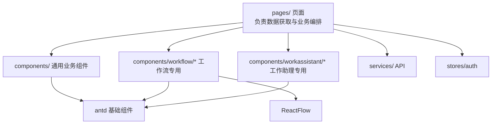
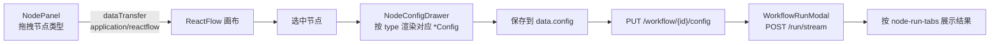

# 前端架构文档

> 面向前端开发者，说明目录结构、路由、组件分层、状态管理与 API 约定。
> 返回 [架构主文档](./ARCHITECTURE.md)

---

## 目录

- [1. 技术栈与工程配置](#1-技术栈与工程配置)
- [2. 目录结构](#2-目录结构)
- [3. 应用入口与全局配置](#3-应用入口与全局配置)
- [4. 路由体系](#4-路由体系)
- [5. 布局与导航](#5-布局与导航)
- [6. 状态管理](#6-状态管理)
- [7. API 服务层](#7-api-服务层)
- [8. 组件分层](#8-组件分层)
- [9. 工作流编辑器](#9-工作流编辑器)
- [10. 流式对话实现](#10-流式对话实现)
- [11. 开发约定](#11-开发约定)

---

## 1. 技术栈与工程配置

| 领域 | 选型 | 版本 |
|---|---|---|
| 框架 | React | 18.2 |
| 语言 | TypeScript | 5.3 |
| 构建 | Vite | 5.0 |
| UI 库 | Ant Design | 5.12 |
| 增强组件 | @ant-design/pro-components | 2.6 |
| 状态管理 | Zustand | 4.4 |
| 工作流画布 | ReactFlow | 11.10 |
| 路由 | react-router-dom | 6.21 |
| HTTP | axios | 1.6 |
| Markdown 渲染 | react-markdown + remark-gfm | 10.1 / 4.0 |
| 日期 | dayjs | 1.11 |
| 样式 | TailwindCSS | 3.4 |
| 包管理 | pnpm | 9 |

### 1.1 Vite 配置要点

```1:26:frontend/vite.config.ts
import { defineConfig } from 'vite'
import react from '@vitejs/plugin-react'
import path from 'path'

// https://vitejs.dev/config/
export default defineConfig({
  plugins: [react()],
  resolve: {
    alias: {
      '@': path.resolve(__dirname, './src'),
    },
  },
  server: {
    port: 3000,
    proxy: {
      '/api': {
        target: 'http://localhost:8000',
        changeOrigin: true,
      },
    },
  },
  build: {
    outDir: 'dist',
    sourcemap: true,
  },
})
```

- 路径别名 **`@` → `src`**，源码中统一使用 `@/services/xxx`、`@/stores/auth` 形式导入
- 开发服务器端口 3000，`/api` 自动代理到后端 8000

### 1.2 可用脚本

```bash
pnpm dev      # 开发服务器 :3000
pnpm build    # tsc && vite build
pnpm lint     # ESLint（--max-warnings 0）
pnpm preview  # 预览构建产物
```

---

## 2. 目录结构

```
frontend/src/
├── main.tsx                    # React 入口（BrowserRouter + ConfigProvider）
├── App.tsx                     # 路由表 + ProtectedRoute
├── pages/                      # 页面组件（24 个）
│   ├── Dashboard.tsx           #   仪表盘
│   ├── Apps.tsx                #   工作室（应用列表）
│   ├── ChatbotOrchestration.tsx / ChatbotDebug.tsx
│   ├── WorkflowOrchestration.tsx
│   ├── AgentOrchestration.tsx / AgentDebug.tsx
│   ├── AppRunner.tsx           #   应用运行（最大页面 ~44KB）
│   ├── PublishManagement.tsx   #   发布管理
│   ├── Knowledge.tsx / KnowledgeDetail.tsx
│   ├── Models.tsx / ModelDetail.tsx
│   ├── Tools.tsx               #   工具管理 + 工具市场
│   ├── WorkAssistant.tsx       #   工作助理
│   ├── Login.tsx / Register.tsx
│   └── Evaluation/             #   评估中心（7 个页面）
│       ├── EvaluationLayout.tsx
│       ├── AnalyticsDashboard.tsx
│       ├── DatasetManagement.tsx
│       ├── EvaluatorManagement.tsx
│       ├── EvaluationList.tsx
│       ├── CreateEvaluation.tsx
│       └── EvaluationReport.tsx
├── components/                 # 组件（44 个）
│   ├── Layout/MainLayout.tsx   #   侧边栏 + 内容区
│   ├── workflow/               #   工作流编辑器组件群
│   ├── workassistant/          #   工作助理组件
│   └── （通用业务组件）          #   PromptEditor / VariableSettings /
│                               #   ModelSelector / ModelParameters /
│                               #   KnowledgeBaseSelector / ToolSelector /
│                               #   ChatPreview / ChunkSettingDrawer /
│                               #   SegmentDrawer / SearchTestPanel
├── services/                   # API 客户端（14 个 .ts）
├── stores/                     # Zustand 状态（auth.ts）
├── hooks/                      # useChatStream.ts / useAttachments.ts
├── types/                      # pagination.ts
├── utils/
└── styles/global.css
```

---

## 3. 应用入口与全局配置

```1:19:frontend/src/main.tsx
import React from 'react'
import ReactDOM from 'react-dom/client'
import { BrowserRouter } from 'react-router-dom'
import { ConfigProvider, App as AntApp } from 'antd'
import zhCN from 'antd/locale/zh_CN'
import App from './App'
import './styles/global.css'

ReactDOM.createRoot(document.getElementById('root')!).render(
  <React.StrictMode>
    <BrowserRouter>
      <ConfigProvider locale={zhCN}>
        <AntApp>
          <App />
        </AntApp>
      </ConfigProvider>
    </BrowserRouter>
  </React.StrictMode>,
)
```

要点：
- `ConfigProvider locale={zhCN}` 全局中文化
- `AntApp` 包裹以启用 `App.useApp()` 形式的 message/modal（避免静态函数上下文丢失）
- 全局样式仅 `styles/global.css`，其余使用 Tailwind 原子类 + antd

---

## 4. 路由体系

### 4.1 路由表

| 路径 | 页面 | 说明 |
|---|---|---|
| `/login` `/register` | Login / Register | 公开路由 |
| `/` | `MainLayout` | 受保护布局，`ProtectedRoute` 包裹 |
| `/dashboard` | Dashboard | 默认首页 |
| `/apps` | Apps | 工作室应用列表 |
| `/apps/:appId/chatbot` | ChatbotOrchestration | 聊天助手编排 |
| `/apps/:appId/chatbot/debug` | ChatbotDebug | 聊天助手调试 |
| `/apps/:appId/workflow` | WorkflowOrchestration | 工作流编排 |
| `/apps/:appId/agent` | AgentOrchestration | Agent 编排 |
| `/apps/:appId/agent/debug` | AgentDebug | Agent 调试 |
| `/apps/:appId/publish` | PublishManagement | 发布管理 |
| `/apps/:appId/run` | AppRunner | 应用运行 |
| `/knowledge` `/knowledge/:id` | Knowledge / KnowledgeDetail | 知识库 |
| `/models` `/models/:providerId` | Models / ModelDetail | 模型管理 |
| `/tools` | Tools | 工具管理 |
| `/work-assistant` | WorkAssistant | 工作助理 |
| `/evaluation` | EvaluationLayout | 评估中心（嵌套路由） |
| `/evaluation/datasets` | DatasetManagement | 数据集 |
| `/evaluation/evaluators` | EvaluatorManagement | 评估器 |
| `/evaluation/tasks` | EvaluationList | 评估任务列表 |
| `/evaluation/tasks/create` | CreateEvaluation | 创建评估 |
| `/evaluation/tasks/:evalId` `/report` | EvaluationReport | 评估报告 |
| `*` | — | 重定向到 `/` |

### 4.2 路由保护

```31:39:frontend/src/App.tsx
const ProtectedRoute: React.FC<{ children: React.ReactNode }> = ({ children }) => {
  const { isAuthenticated } = useAuthStore()

  if (!isAuthenticated) {
    return <Navigate to="/login" replace />
  }

  return <>{children}</>
}
```

保护判断基于 Zustand 中**持久化**的 `isAuthenticated` 标志，刷新页面不会丢失登录态。

---

## 5. 布局与导航

`components/Layout/MainLayout.tsx` 提供：

- 固定左侧 `Sider`（可折叠，Logo / 菜单 / 用户信息 / 折叠按钮）
- 右侧 `Content` 渲染 `<Outlet />`

### 5.1 菜单项

| key | 标题 | 图标 |
|---|---|---|
| `/dashboard` | 仪表盘 | DashboardOutlined |
| `/apps` | 工作室 | AppstoreOutlined |
| `/knowledge` | 知识库 | BookOutlined |
| `/models` | 模型管理 | SettingOutlined |
| `/tools` | 工具管理 | ToolOutlined |
| `/evaluation` | 评估中心 | BarChartOutlined |
| `/work-assistant` | 工作助理 | RobotOutlined |

### 5.2 内容区间距控制

`routeConfig` 定义每个路由的 `hasPadding`，编排/调试类页面无间距（全屏画布），列表类页面有间距：

```ts
const routeConfig: Record<string, { hasPadding?: boolean }> = {
  '/dashboard': { hasPadding: true },
  '/apps/:appId/workflow': { hasPadding: false },
  '/evaluation': { hasPadding: false },
  // ...
}
```

匹配逻辑 `matchRouteConfig()`：先精确匹配，再将含 `:` 的模式转为正则匹配动态段（如 `/apps/123/chatbot` → `/apps/:appId/chatbot`）。

---

## 6. 状态管理

全局状态仅一个 store：`stores/auth.ts`（Zustand + `persist`）。

### 6.1 State

```ts
interface AuthState {
  user: User | null
  token: string | null
  isAuthenticated: boolean
  isLoading: boolean
  error: string | null

  login: (username: string, password: string) => Promise<void>
  register: (email, username, password, fullName?) => Promise<void>
  logout: () => void
  fetchUser: () => Promise<void>
  clearError: () => void
}
```

### 6.2 持久化

```ts
persist(..., {
  name: 'auth-storage',
  partialize: (state) => ({
    token: state.token,
    isAuthenticated: state.isAuthenticated,
  }),
})
```

**仅持久化 `token` 与 `isAuthenticated`**，`user` 每次通过 `fetchUser()` 重新拉取，避免本地用户信息过期。

> 其余业务状态均为组件内 `useState` 局部状态，未引入全局 store。

---

## 7. API 服务层

### 7.1 axios 实例 — `services/api.ts`

| 配置 | 值 |
|---|---|
| `baseURL` | `/api/v1` |
| `timeout` | 120000 ms（2 分钟，兼容长 LLM 请求） |

**请求拦截器**：从 `useAuthStore.getState().token` 读取 token，注入 `Authorization: Bearer <token>`。

> 使用 `getState()` 而非 Hook，使拦截器可在非 React 环境调用。

**响应拦截器**：401 时自动 `logout()` 并跳转 `/login`。

### 7.2 服务模块

| 文件 | 对应后端模块 |
|---|---|
| `services/auth.ts` | `/users` |
| `services/apps.ts` | `/apps` |
| `services/chatbot.ts` | `/chatbot` |
| `services/workflow.ts` | `/workflow` |
| `services/agent.ts` | `/agent` |
| `services/knowledge.ts` | `/knowledge` |
| `services/models.ts` | `/models` |
| `services/tools.ts` | `/tools` |
| `services/publish.ts` | `/apps/{id}/publish` |
| `services/evaluation.ts` | `/evaluation` |
| `services/hermes.ts` | `/hermes`（含 SSE） |
| `services/openclaw.ts` | OpenClaw（**后端未挂载**） |

`services/index.ts` 作为 barrel 统一导出（除 `api.ts` 与 `openclaw.ts`）。

### 7.3 两种请求方式

| 场景 | 方式 | 原因 |
|---|---|---|
| 普通 REST | axios 实例 | 自动注入 token、统一错误处理 |
| **SSE 流式** | 原生 `fetch` + `ReadableStream` | axios 对流式响应支持不佳 |

SSE 实现（`services/workflow.ts: runStream`）手动解析 SSE 帧：按 `\n` 切分 buffer，识别 `event:` 与 `data:` 行，以 async generator 形式 `yield { event, data }`，并手动注入 `Authorization` 头。

---

## 8. 组件分层



### 8.1 通用业务组件

| 组件 | 用途 |
|---|---|
| `PromptEditor.tsx` | 提示词编辑器（根级，轻量封装） |
| `VariableSettings.tsx` | 变量配置（文本/段落/下拉/数字/复选框/API 六种类型） |
| `ModelSelector.tsx` | 模型选择 |
| `ModelParameters.tsx` | 温度、Top-P、最大 token 等参数 |
| `KnowledgeBaseSelector.tsx` | 知识库选择 |
| `ToolSelector.tsx` | 工具选择 |
| `ChatPreview.tsx` | 对话预览 |
| `SearchTestPanel.tsx` | 知识库检索测试 |
| `ChunkSettingDrawer.tsx` | 分片策略配置抽屉 |
| `SegmentDrawer.tsx` | 分片查看抽屉 |

> 这类组件在聊天助手、Agent、知识库等页面间复用，是保持各编排页体验一致的关键。

---

## 9. 工作流编辑器

`WorkflowOrchestration.tsx` 搭配 `components/workflow/` 组件群实现可视化编排。

### 9.1 节点类型（`services/workflow.ts`）

| type | 标签 | 描述 | 颜色 |
|---|---|---|---|
| `start` | 用户输入 | 用于节点开始，定义输入变量 | `#52c41a` |
| `end` | 直接回复 | 设置回复内容，可引用上游变量 | `#ff4d4f` |
| `llm` | LLM | 调用大语言模型 | `#1677ff` |
| `knowledge_retrieval` | 知识库 | 从知识库检索相关文档 | `#722ed1` |
| `condition` | 条件分支 | 根据条件分支执行 | `#1677ff` |
| `question_classifier` | 问题分类器 | 使用 LLM 对输入进行分类 | `#13c2c2` |
| `code` | 代码 | 执行自定义代码 | `#13c2c2` |
| `http` | HTTP | 发送 HTTP 请求 | `#eb2f96` |
| `tool` | 工具 | 调用已注册的工具 | `#595959` |
| `human_intervention` | 人工介入 | 等待人工审批或输入 | `#1677ff` |

### 9.2 组件结构

```
components/workflow/
├── NodePanel.tsx               # 左侧可拖拽节点列表（渲染 NODE_TYPES）
├── NodeConfigDrawer.tsx        # 节点配置抽屉（按类型分发）
├── WorkflowRunModal.tsx        # 运行弹窗（展示流式执行结果）
├── DSLImportModal.tsx          # DSL 导入
├── nodes/                      # 画布节点渲染
│   ├── BaseNode.tsx            #   节点基类（统一样式/Handle）
│   └── StartNode / EndNode / LLMNode / KnowledgeNode / ConditionNode
│       / CodeNode / HTTPNode / ToolNode / HumanInterventionNode
│       / QuestionClassifierNode
├── node-configs/               # 各类型配置表单
│   └── StartConfig / EndConfig / LLMConfig / KnowledgeConfig
│       / ConditionConfig / CodeConfig / HTTPConfig / ToolConfig
│       / HumanInterventionConfig / QuestionClassifierConfig
├── node-run-tabs/              # 运行详情 Tab
│   └── LLMRunTab / KnowledgeRunTab
└── shared/                     # 共用原子组件
    ├── PromptEditor.tsx        #   支持变量插入的提示词编辑器
    ├── InputVariablesList.tsx  #   输入变量列表
    └── VarDropdown.tsx         #   变量下拉选择器
```

### 9.3 交互流程



### 9.4 数据结构

```ts
interface WorkflowNode {
  id: string
  type: NodeType
  position: { x: number; y: number }
  data: { label: string; description?: string; config: Record<string, any> }
}

interface WorkflowEdge {
  id: string
  source: string
  target: string
  sourceHandle?: string   // 条件分支的分支名，如 "true" / "false"
  targetHandle?: string
  label?: string
}
```

> `sourceHandle` 是条件分支的关键：后端 `GraphBuilder` 用它构建 `分支名 → 目标节点` 映射。

---

## 10. 流式对话实现

### 10.1 `hooks/useChatStream.ts`

Hermes 工作助理的 SSE 消费 Hook。

```ts
const { content, loading, error, toolsUsed, inputTokens, outputTokens, send, cancel, reset }
  = useChatStream()
```

| 成员 | 说明 |
|---|---|
| `send(sessionId, message, token, model?)` | 发起流式请求，内部自动取消上一请求 |
| `cancel()` | 通过 `AbortController` 中断 |
| `reset()` | 取消并重置状态 |
| `content` | 累积的内容增量 |
| `toolsUsed` | 工具调用列表（`running` / `done` 状态） |
| `inputTokens` / `outputTokens` | 从 `message_end` 的 usage 读取 |

**事件回调映射**：

| SSE 事件 | 处理 |
|---|---|
| `message_start` | `loading = true` |
| `content_delta` | `content += data.content` |
| `tool_start` | 追加 toolsUsed（`status: 'running'`） |
| `tool_result` | 匹配同名且 running 的工具，写入 output 并置 `done` |
| `message_end` | `loading = false`，记录 token 用量 |
| `error` | `loading = false`，记录 error |

### 10.2 工作助理组件

```
pages/WorkAssistant.tsx
└── components/workassistant/
    ├── AgentSidebar.tsx        # 会话列表侧栏（本次未改动）
    ├── ChatArea.tsx            # 聊天区域：编排欢迎页/消息视图 + 上传状态
    ├── WelcomeView.tsx         # 欢迎页：机器人图标 + 问候语 + 推荐提示词卡片网格
    ├── ComposerInput.tsx       # 输入区：上传入口 / 附件 chips / 快捷指令面板 / 发送
    ├── AttachmentChips.tsx     # 待发送附件 chips（图片缩略图 / 文件图标 / 删除）
    ├── QuickPromptPanel.tsx     # 快捷指令面板（搜索 + 分组）
    ├── MessageBubble.tsx       # 消息气泡（含工具调用 + 历史附件展示）
    └── AttachmentImage         # AttachmentChips 导出：历史图片 blob 缩略图
hooks/useAttachments.ts          # 上传队列状态机（pending/success/error）
```

工作助理数据层（`services/hermes.ts`）本次新增：
- `uploadAttachment` / `deleteAttachment` / `getSessionAttachments`：附件上传 / 删除 / 按会话列举
- `getQuickPrompts` / `createQuickPrompt` / `updateQuickPrompt` / `deleteQuickPrompt`：提示词 CRUD
- `chatStream` 改为**对象参数**（`{ sessionId, message, callbacks, options, token }`），`options` 新增 `attachmentIds`；`HermesAttachment` / `QuickPrompt` 类型新增
- `useChatStream.send` 同步改为对象参数，透传 `attachmentIds`

---

## 11. 开发约定

### 11.1 命名

| 对象 | 约定 | 示例 |
|---|---|---|
| 页面组件 | PascalCase，按功能命名 | `WorkflowOrchestration.tsx` |
| 服务模块 | camelCase 文件名，导出 `xxxApi` 对象 | `workflow.ts` → `workflowApi` |
| API 方法 | 动词开头 | `getConfig` / `updateConfig` / `runStream` |
| 类型 | PascalCase，集中在服务文件顶部 | `WorkflowNode`、`NodeType` |

### 11.2 数据获取

- 页面级数据在 `useEffect` 中通过 `services/*` 拉取，存于组件 `useState`
- 未引入 React Query 等数据层库，需自行处理 loading / error / 重新拉取

### 11.3 样式

- 优先使用 **Tailwind 原子类**（如 `flex flex-col gap-2`）
- 自定义设计令牌在 `styles/global.css` 与 Tailwind 配置中定义（如 `bg-page`、`border-border`、`h-header`、`ml-sider`、`shadow-sider`）
- 复杂组件直接用 antd，避免重复造轮子

### 11.4 新增页面流程

1. 在 `services/` 添加/扩展 API 客户端
2. 在 `pages/` 创建页面组件
3. 在 `App.tsx` 的 `<Route>` 树中注册路由
4. 如需侧边栏入口，在 `MainLayout.tsx` 的 `menuItems` 中添加
5. 如需全屏布局，在 `routeConfig` 中设置 `hasPadding: false`

### 11.5 已知问题

| 问题 | 说明 |
|---|---|
| `services/openclaw.ts` 无对应页面 | 后端 OpenClaw 路由未挂载，前端服务为死代码 |
| `services/index.ts` 未导出 `openclaw` | 与上述一致 |
| 仅 `Login`/`Register` 为公开路由 | 无"忘记密码"等流程 |
| 无全局数据请求层 | 各页面自行管理 loading/error，存在重复代码 |
