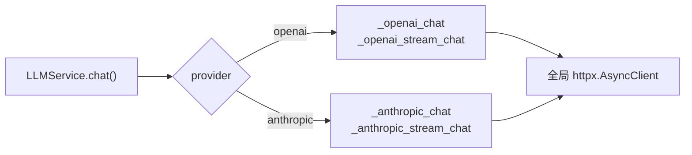
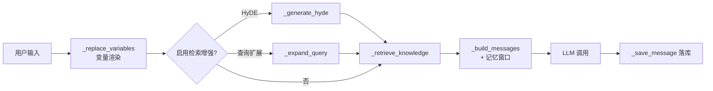
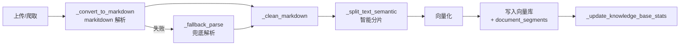
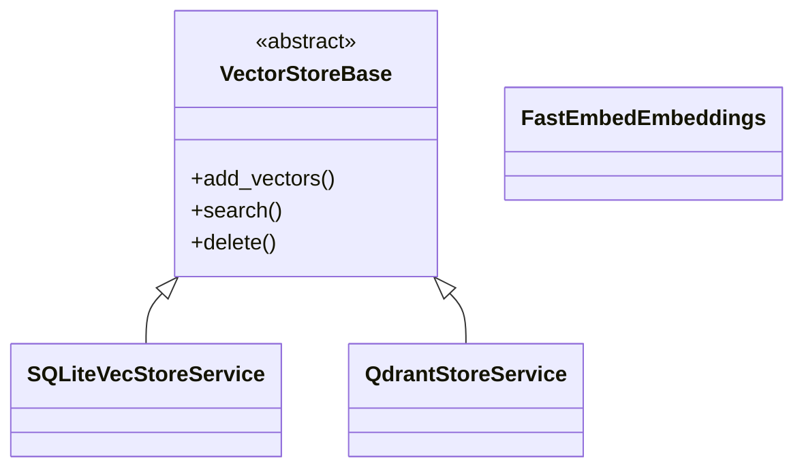
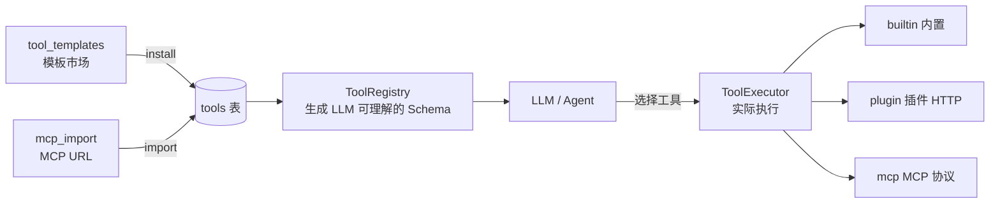
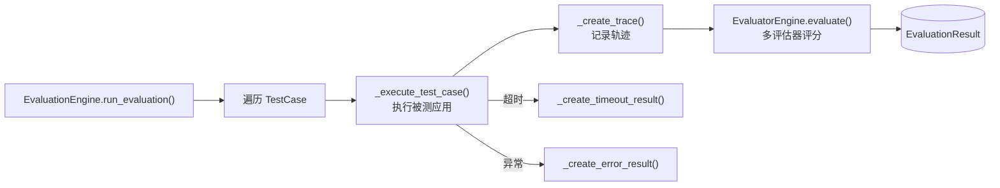
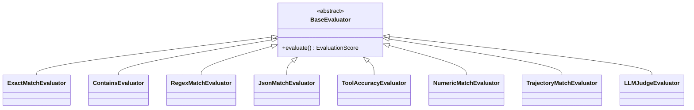
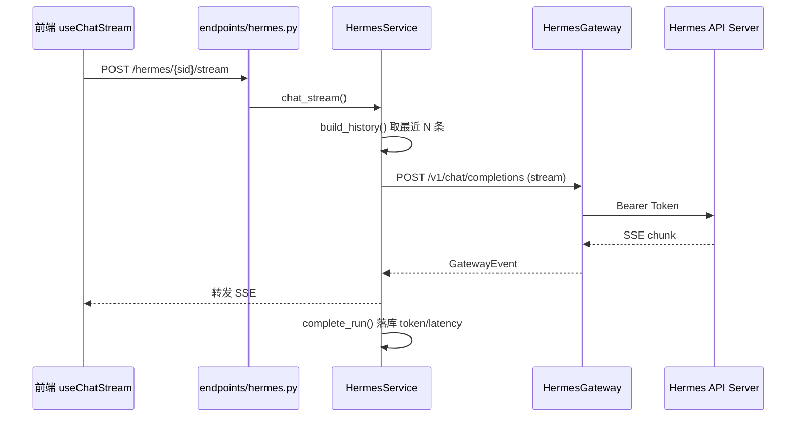
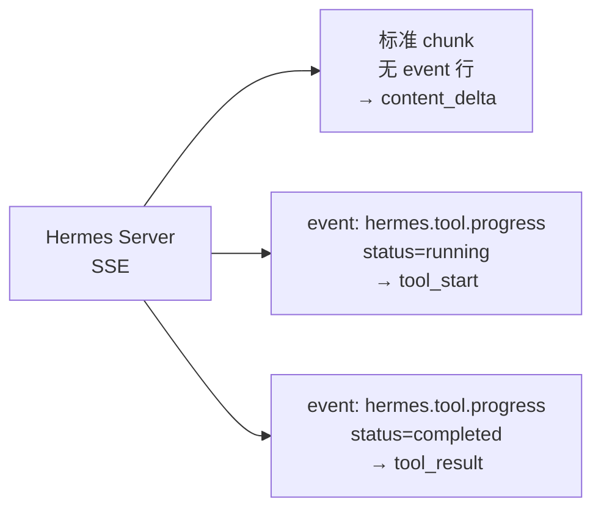
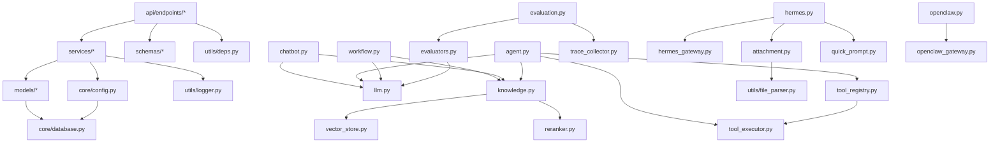

# 后端模块文档

> 详细说明 `backend/app/` 下各模块的职责、核心类与关键函数。
> 返回 [架构主文档](./ARCHITECTURE.md)

---

## 目录

- [1. 模块总览](#1-模块总览)
- [2. core — 基础设施](#2-core--基础设施)
- [3. utils — 工具与依赖注入](#3-utils--工具与依赖注入)
- [4. LLM 抽象层](#4-llm-抽象层)
- [5. 应用执行服务](#5-应用执行服务)
- [6. 知识库与向量检索](#6-知识库与向量检索)
- [7. 工具体系](#7-工具体系)
- [8. 发布服务](#8-发布服务)
- [9. 评估体系](#9-评估体系)
- [10. 外部 Agent 集成](#10-外部-agent-集成)
- [11. 数据集加载器](#11-数据集加载器)
- [12. 模块依赖图](#12-模块依赖图)

---

## 1. 模块总览

| 文件 | 主类 / 入口 | 职责 |
|---|---|---|
| `core/config.py` | `Settings` | 配置管理 |
| `core/database.py` | `engine` / `SessionLocal` / `Base` | 数据库连接 |
| `core/security.py` | `create_access_token` / `verify_password` | 鉴权与密码 |
| `core/seed.py` | `seed_data(db)` | 启动种子数据 |
| `utils/deps.py` | `get_db` / `get_current_user` | FastAPI 依赖注入 |
| `utils/pagination.py` | `apply_cursor_pagination` | 游标分页 |
| `utils/logger.py` | `logger` | 统一日志 |
| `services/llm.py` | `LLMService` | LLM 统一调用 |
| `services/chatbot.py` | `ChatbotService` | 聊天助手执行 |
| `services/workflow.py` | `WorkflowService` / `GraphBuilder` | 工作流引擎 |
| `services/agent.py` | `AgentService` | Agent ReAct 执行 |
| `services/knowledge.py` | `KnowledgeService` | 知识库文档处理与检索 |
| `services/vector_store.py` | `VectorStoreBase` + 两个实现 | 向量存储抽象 |
| `services/reranker.py` | `RerankerService` | Cross-Encoder 重排序 |
| `services/crawler.py` | `WebCrawler` | URL 爬取 |
| `services/tool_registry.py` | `ToolRegistry` | 工具定义（给 LLM 用） |
| `services/tool_executor.py` | `ToolExecutor` | 工具执行 |
| `services/tool_templates.py` | `get_all_templates()` 等 | 内置工具模板市场 |
| `services/mcp_import.py` | `import_mcp_tools()` | MCP 工具导入 |
| `services/publish.py` | `PublishService` | 渠道发布配置 |
| `services/evaluation.py` | `EvaluationEngine` | 评估执行引擎 |
| `services/evaluators.py` | `BaseEvaluator` + 9 个实现 | 评估器 |
| `services/trace_collector.py` | `TraceCollector` | 执行轨迹采集 |
| `services/hermes.py` | `HermesService` | Hermes SSE 中继 |
| `services/hermes_gateway.py` | `HermesGateway` | Hermes API 客户端 |
| `services/openclaw.py` | `OpenClawService` | OpenClaw 服务（未启用） |
| `services/openclaw_gateway.py` | `OpenClawGateway` | OpenClaw API 客户端 |
| `services/datasets/bfcl_loader.py` | `BFCLDatasetLoader` | BFCL 数据集加载 |

**通用约定**：每个 Service 提供一个 `get_xxx_service(...)` 工厂函数，供 API 端点通过依赖注入获取实例。

---

## 2. core — 基础设施

### 2.1 `config.py`

`Settings` 继承 `pydantic_settings.BaseSettings`，`env_file=(".env.local", ".env")`。

优先级：**环境变量 > `.env.local` > `.env` > 代码默认值**

特殊处理：`BACKEND_CORS_ORIGINS` / `CORS_ORIGINS` 支持逗号分隔字符串自动转为列表（`@validator(..., pre=True)`）。

### 2.2 `database.py`

根据 `DATABASE_URL` 前缀自动切换引擎参数：

| 数据库 | 配置 |
|---|---|
| `sqlite*` | `check_same_thread=False` + 事件监听设置 `PRAGMA journal_mode=WAL`、`PRAGMA busy_timeout=5000` |
| 其他（PostgreSQL） | `pool_pre_ping=True`、`pool_size=10`、`max_overflow=20` |

### 2.3 `security.py`

| 函数 | 说明 |
|---|---|
| `create_access_token(subject, expires_delta)` | 签发 JWT，payload 为 `{"exp", "sub"}` |
| `verify_password(plain, hashed)` | bcrypt 校验 |
| `get_password_hash(password)` | bcrypt 哈希 |
| `oauth2_scheme` | `OAuth2PasswordBearer(tokenUrl="/api/v1/users/login")` |

### 2.4 `seed.py`

启动时由 `main.lifespan` 调用，初始化：管理员账号（密码取 `ADMIN_PASSWORD`）、默认模型供应商、内置工具模板。

---

## 3. utils — 工具与依赖注入

### 3.1 `deps.py`

```python
get_db()                        # yield Session，finally 关闭
get_current_user()              # JWT 解码 → 查 User → is_active 校验
get_current_active_superuser()  # 额外校验 is_superuser
```

### 3.2 `pagination.py`

`apply_cursor_pagination(query, cursor, limit, ...)` 实现游标分页，返回 `CursorResponse`。

---

## 4. LLM 抽象层

**文件**：`services/llm.py`



| 成员 | 说明 |
|---|---|
| `_http_client` | **模块级全局连接池**：`max_keepalive=20`、`max_connections=50`、`keepalive_expiry=30s`；超时 connect 10s / read 120s / write 10s / pool 5s |
| `close_http_client()` | 应用关闭时由 lifespan 调用释放连接 |
| `register_provider(type, api_key, endpoint, **kw)` | 注册供应商凭据到内存字典 |
| `chat(...)` | 同步对话，返回 `{content, model, tokens_used, finish_reason}` |
| `stream_chat(...)` | 异步生成器，逐段 yield 文本 |

**Anthropic 适配**：自动将 `role=system` 的消息提取到顶层 `system` 字段，并把 usage 映射为 `prompt_tokens` / `completion_tokens`。

> ⚠️ 每次调用需先 `register_provider`，配置来自 `Model.provider` 关联对象。

---

## 5. 应用执行服务

### 5.1 `services/chatbot.py` — `ChatbotService`

| 方法 | 说明 |
|---|---|
| `get_chatbot_config` / `save_chatbot_config` / `update_chatbot_config` | 配置存取（存于 `App.config`） |
| `chat()` | 非流式对话主流程 |
| `chat_stream()` | SSE 流式对话 |
| `_replace_variables()` | 变量渲染（`{{var}}` 占位符替换） |
| `_retrieve_knowledge()` | 知识库检索（Top-K + 阈值） |
| `_generate_hyde()` | **HyDE**：生成假设性文档再嵌入检索 |
| `_expand_query()` | **查询扩展**：LLM 改写/扩展查询 |
| `_build_messages()` | 拼装 system + 历史 + 上下文 + 用户消息 |
| `_get_history()` | 按记忆窗口截取历史 |
| `_create_conversation` / `_save_message` / `list_conversations` / `delete_conversation` | 会话与消息持久化 |
| `_generate_demo_response()` | 无 LLM 配置时的兜底演示回复 |

**执行流程**：



### 5.2 `services/workflow.py` — `WorkflowService` / `GraphBuilder`

| 组件 | 说明 |
|---|---|
| `WorkflowState` | TypedDict，含 `inputs`、`node_outputs`（`operator.or_`）、`execution_log`（`operator.add`） |
| `_make_*_node()` | 10 种节点工厂函数（见 [ARCHITECTURE.md §7.1](./ARCHITECTURE.md#71-工作流执行langgraph)） |
| `_make_condition_router()` / `_make_question_classifier_router()` | 条件路由函数 |
| `execute_llm_node()` | 通用 LLM 节点执行逻辑，支持结构化输出（JSON Schema 注入 + 正则兜底解析） |
| `_replace_vars()` / `_resolve_var_template()` | 变量模板解析 |
| `GraphBuilder.build()` | 动态编译 LangGraph `StateGraph` |
| `WorkflowService.run_workflow()` | 非流式执行 |
| `WorkflowService.run_workflow_stream()` | 流式执行，通过 `token_queue` 传递 LLM token |
| `export_dsl()` / `import_dsl()` | DSL 导入导出 |
| `list_runs()` / `get_run()` | 运行记录查询 |

**流式实现要点**：`run_workflow_stream` 创建 `asyncio.Queue`，将其传给 `GraphBuilder`，LLM 节点在产生 token 时 `put` 到队列；主协程后台执行 graph，同时从队列读取并 yield SSE 事件。

### 5.3 `services/agent.py` — `AgentService`

| 方法 | 说明 |
|---|---|
| `get_agent_config` / `save_agent_config` | 配置存取 |
| `_build_agent()` | 构建 LangGraph Agent（ReAct） |
| `_prepare_conversation()` | 会话准备与历史裁剪 |
| `chat()` / `chat_stream()` | 非流式 / SSE 流式对话 |
| `_get_llm()` / `_get_tools()` | 按配置获取 LLM 与工具列表 |
| `_build_system_prompt()` / `_replace_variables()` | 提示词构建 |
| `_retrieve_knowledge()` | 知识库上下文检索 |
| `_extract_result()` | 提取最终答案、工具调用、思考链 |
| `_create_conversation` / `_save_message` | 持久化 |
| `make_delete_old_messages(max_messages)` | 历史裁剪中间件 |
| `_parse_thinking_tags()` | 解析 `<thinking>` 标签，分离推理与回答 |

---

## 6. 知识库与向量检索

### 6.1 `services/knowledge.py` — `KnowledgeService`

**文档处理流水线**：



| 方法 | 说明 |
|---|---|
| `parse_document()` | 解析文档为 Markdown |
| `preview_chunks()` | 分片预览（调参用，**不落库**） |
| `process_document()` | 完整流水线：解析 → 分片 → 向量化 → 入库 |
| `_convert_to_markdown()` / `_fallback_parse()` | 主/兜底解析（含 `_preprocess_html`） |
| `_split_text_semantic()` | 语义分片主入口 |
| `_split_by_headers()` / `_split_into_blocks()` / `_split_large_table()` / `_sliding_window_split()` / `_split_by_paragraph()` | 多种分片策略 |
| `search()` | 检索入口，分发到不同策略 |
| `_search_vector()` | 稠密向量检索 |
| `_search_bm25()` | BM25 稀疏检索 |
| `_search_rrf()` | **RRF 融合**（Reciprocal Rank Fusion，混合检索） |
| `_enrich_results()` | 结果富化（补齐文档名等） |
| `delete_document()` | 删除文档及向量 |
| `vector_store` (property) | 懒加载向量存储服务 |

支持的检索增强：**HyDE**、**查询扩展**、**RRF 混合检索**、**Cross-Encoder 重排序**。

### 6.2 `services/vector_store.py`



| 组件 | 说明 |
|---|---|
| `VectorStoreBase` | 抽象基类（ABC） |
| `FastEmbedEmbeddings` | 封装 fastembed，支持稠密 + 稀疏（BM25） |
| `SQLiteVecStoreService` | 基于 `sqlite-vec`，默认后端 |
| `QdrantStoreService` | 基于 Qdrant，支持混合检索 |
| `create_vector_store_service()` | 按配置创建实例 |
| `get_vector_store_service()` | 获取全局单例 |

> ⚠️ `config.VECTOR_STORE` 文档注释提到 `pgvector`，但代码**未实现**对应类，选择该值会失败。

### 6.3 `services/reranker.py` — `RerankerService`

使用 fastembed `TextCrossEncoder`（默认 `BAAI/bge-reranker-base`）：

- **懒加载**模型，首次调用时初始化
- 阻塞推理通过 `asyncio.to_thread()` 移出事件循环
- 原始 logits 经 Sigmoid 归一化到 0–1，写入 `rerank_score`
- 通过 `get_reranker_service()` 获取全局单例

### 6.4 `services/crawler.py` — `WebCrawler`

数据类 `CrawlPage`、`CrawlResult`，`WebCrawler` 负责抓取 URL 内容并转为文档入库。

---

## 7. 工具体系

工具系统分为**定义**与**执行**两条线：



### 7.1 `tool_registry.py` — `ToolRegistry`

将数据库工具记录转换为 LLM 可用的工具定义。

| 方法 | 说明 |
|---|---|
| `get_tools()` | 批量获取工具定义 |
| `_build()` | 按 `tool_type` 分发构造 |
| `_create_builtin()` / `_create_plugin()` / `_create_mcp()` / `_create_api_tool()` | 各类型构造 |
| `_run_search()` / `_run_browse()` / `_run_code()` / `_run_knowledge()` / `_run_calculator()` | 内置工具实现 |
| `_make_schema()` | 生成参数 JSON Schema |

### 7.2 `tool_executor.py` — `ToolExecutor`

| 方法 | 说明 |
|---|---|
| `execute()` | 统一执行入口，按类型分发 |
| `_execute_builtin()` | 内置工具：web_search / web_browse / code_interpreter / calculator |
| `_execute_plugin()` | 插件工具（HTTP 调用） |
| `_execute_mcp()` | MCP 工具（MCP 协议调用） |

### 7.3 `tool_templates.py`

内置工具模板市场，提供 `get_all_templates()` / `get_template_by_id()` / `get_templates_by_category()` / `get_categories()`。

### 7.4 `mcp_import.py`

| 函数 | 说明 |
|---|---|
| `fetch_mcp_tools(url)` | 从 MCP Server URL 拉取工具列表 |
| `_parse_mcp_so()` | 解析 MCP.so 格式页面 |
| `build_tool_from_mcp()` | 转换为 `Tool` 模型 |
| `import_mcp_tools()` | 批量导入并落库 |

---

## 8. 发布服务 — `services/publish.py`

| 方法 | 说明 |
|---|---|
| `get_all_configs()` / `get_config()` / `update_config()` | 配置读写 |
| `enable_channel()` / `disable_channel()` | 渠道启停 |
| `_get_or_create_config()` | 惰性创建渠道记录 |
| `_build_channel_response()` | 构造响应（含使用指南） |

渠道配置生成器：

| 渠道 | 生成函数 | 产出 |
|---|---|---|
| `api` | `_generate_api_key()` | API Key + 调用示例 |
| `mcp` | `_generate_mcp_config()` | MCP Server 配置 JSON |
| `embed` | `_generate_embed_code()` | iframe 嵌入代码 |
| `wechat` | `_generate_wechat_guide()` | Webhook 对接指南 |
| `h5` | `_generate_h5_url()` | 移动端访问链接 |

---

## 9. 评估体系



### 9.1 `services/evaluation.py` — `EvaluationEngine`

| 方法 | 说明 |
|---|---|
| `run_evaluation(evaluation_id)` | 评估主循环，更新 progress |
| `_execute_test_case()` | 执行单个测试用例 |
| `_create_trace()` | 创建执行轨迹 |
| `_create_timeout_result()` / `_create_error_result()` | 异常结果落库 |

### 9.2 `services/evaluators.py` — 评估器

继承体系：



| 评估器 | metric_type | 说明 |
|---|---|---|
| `ExactMatchEvaluator` | `exact_match` | 精确匹配 |
| `ContainsEvaluator` | `contains` | 包含匹配 |
| `RegexMatchEvaluator` | `regex` | 正则匹配 |
| `JsonMatchEvaluator` | `json_match` | JSON 结构匹配 |
| `ToolAccuracyEvaluator` | `tool_accuracy` | 工具调用准确率 |
| `NumericMatchEvaluator` | `numeric_match` | 数值匹配（含容差） |
| `TrajectoryMatchEvaluator` | `trajectory_match` | 轨迹匹配，用 **LCS**（最长公共子序列）比对步骤 |
| `LLMJudgeEvaluator` | — | LLM 裁判，解析模型打分响应 |

`EvaluatorEngine` 负责按 `Evaluator` 记录实例化对应评估器，`create_builtin_evaluators()` 初始化内置评估器集合。

`EvaluationScore` 封装得分与各维度详情，提供 `to_dict()`。

### 9.3 `services/trace_collector.py` — `TraceCollector`

采集 LLM 调用、工具调用、工作流节点执行的步骤，汇总 `total_steps` / `total_llm_calls` / `total_tool_calls` / `total_time_ms` / `total_tokens` 后写入 `traces` 表。

---

## 10. 外部 Agent 集成

### 10.1 Hermes（已启用）



| 文件 | 职责 |
|---|---|
| `services/hermes.py` | `HermesService`：会话/消息/运行 CRUD、历史构建、SSE 中继与落库 |
| `services/hermes_gateway.py` | `HermesGateway`：OpenAI Chat Completions 兼容客户端；`GatewayEvent` 封装事件 |

`HermesService` 主要方法：`create_session` / `get_session` / `list_sessions` / `delete_session` / `update_session_title` / `create_message` / `get_messages` / `build_history`（产出纯文本或 content 数组）/ `create_run` / `complete_run` / `chat_stream`。

#### 关联服务（本次新增）

| 文件 | 职责 |
|---|---|
| `utils/file_parser.py` | 模块级 `convert_to_markdown(file_path, file_type)`，文档→Markdown（markitdown + fallback）；`KnowledgeService` 已委托复用 |
| `services/attachment.py` | `AttachmentService`：白名单校验、UUID 落盘、文档同步解析、`read_bytes`/`data_uri`、归属校验的查询/删除/绑定、content fragment 转换 |
| `services/quick_prompt.py` | `QuickPromptService`：内置 + 本人自建提示词的列表/增删改与内置集初始化 |

`build_history` 改造要点：user 消息携带附件时 content 升级为 fragment 数组（文本 + `image_url`(base64) / 文档文本）；历史图片仅保留最近 `HERMES_HISTORY_IMAGE_TURNS` 轮，更早期降级为文本占位以控制体积。

历史消息条数由 `HERMES_MAX_HISTORY_MESSAGES` 控制（默认 20）。

#### 上游双通道协议（易踩坑）

Hermes **不使用** OpenAI `delta.tool_calls`，而是通过自定义事件传递工具信息：



```http
event: hermes.tool.progress
data: {"tool":"terminal","emoji":"💻","label":"ls -la","toolCallId":"call_xxx","status":"running"}

event: hermes.tool.progress
data: {"tool":"terminal","toolCallId":"call_xxx","status":"completed"}
```

| 事实 | 后果 |
|---|---|
| 工具事件带 `event:` 行 | 解析器若忽略 `event:` 行，工具事件会被当空 chunk 丢弃 |
| 正文阶段 `finish_reason` 恒为 `null` | 不能靠 `finish_reason == "tool_calls"` 触发工具事件 |
| **不回传工具执行结果** | `tool_result.tool_output` 通常为空，仅用于标记完成 |
| `usage` 藏在最后一个 chunk 的 `choices` 同帧 | 需在 choices 分支内再检查 `usage`，否则 token 统计恒为 0 |

工具配对统一使用 `toolCallId`（缺 ID 时回退到同名匹配）。

### 10.2 OpenClaw（未启用）

| 文件 | 职责 |
|---|---|
| `services/openclaw.py` | `OpenClawService`：会话管理、SSE 处理、独立连接池 |
| `services/openclaw_gateway.py` | `OpenClawGateway`：API 客户端 |

> ⚠️ 路由未挂载、模型未导出、缺少配置项，当前不可达。详见 [ARCHITECTURE.md §11](./ARCHITECTURE.md#11-已知问题与技术债)。

---

## 11. 数据集加载器 — `services/datasets/bfcl_loader.py`

`BFCLDatasetLoader` 负责加载 Berkeley Function Calling Leaderboard 基准数据集，转换为平台 `TestCase` 结构。

---

## 12. 模块依赖图



---

## 附录：新增一个业务模块的步骤

1. **Model**：在 `models/` 新建 ORM 类，并在 `models/__init__.py` 中导出
2. **Schema**：在 `schemas/` 定义 Pydantic 请求/响应模型
3. **Service**：在 `services/` 实现业务逻辑，提供 `get_xxx_service(db)` 工厂
4. **Endpoint**：在 `api/endpoints/` 建路由，用 `Depends(get_current_user)` 保护
5. **注册路由**：在 `api/api.py` 中 `include_router`
6. **迁移**：`alembic revision --autogenerate -m "..."` 并 `upgrade head`
7. **前端**：`services/` 加 API 客户端 → `pages/` 加页面 → `App.tsx` 注册路由 → `MainLayout.tsx` 加菜单
